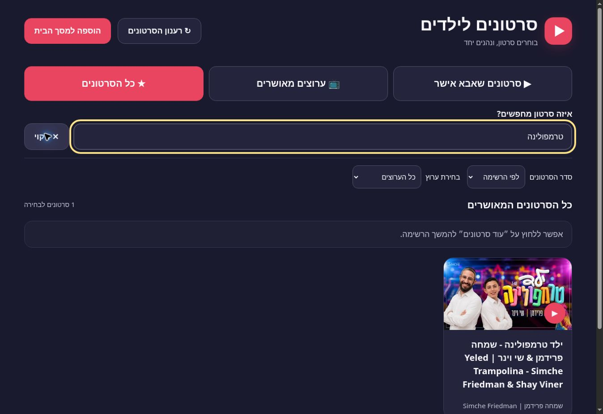

# בדיקת השדרוג — 6 באוקטובר 2026

## סטטוס אמיתי

השדרוג נבנה ופורסם, אך **אין אישור שכל מסלולי הניגון הציבוריים זמינים**. ניגון חי ב־Invidious הצליח בתחילת הבדיקה, ובהמשך הספק הציג Anubis/״Making sure you're not a bot״ לדפדפן הבדיקה. לא נעקפה החסימה ולא בוצעה בדיקה חוזרת שלה. GitHub Pages בלבד, בלי שרת, לא מאפשר לתקן CORS של ספק או להבטיח זמינות שלו. אין fallback אוטומטי ל־YouTube שעלול להוסיף פרסומות.

## קוד ו־CI

108 בדיקות Node עברו באמצעות `node --test tests/*.test.cjs`, ללא התקנת packages. הקוד האמיתי של app.js/providers.js/player.js/service worker נבדק; ה־DOM, המדיה וה־API מדומים בבדיקות היחידה. בדיקות אלו אינן הוכחה לניגון אצל ספק חיצוני. GitHub Actions מריץ את הבדיקות לפני פריסה סטטית; אין build step.

הבדיקות מכסות שלושה טאבים והפרדת הרשאות, קישורים/הערות/כינויים ושמות אוטומטיים, ביטול אישורים ומטמון, channel ID שאינו מתאים, pagination לפי דרישה, maxVideos, כפילויות, token שחוזר וגבול 100 עמודים, חיפוש מקומי, מיון/סינון, מטמון TTL וכשל quota, 401/403/404/429/500, TypeError של רשת/CORS, timeout גם בגוף התשובה, cooldown, coalescing, health check, ביטול בקשות ולחיצות מהירות, אירועי מדיה מאוחרים, autoplay חסום, סגירה, מסלול תאימות, אימות מקור/שולח בהודעות הנגן וניתוק listener בסגירה, CSP עם נתיב הסרטון המדויק, deadline לנגן, PWA, shell offline ונתיבים יחסיים.

## דפדפן אמיתי

- Desktop Chrome: שלושת הטאבים נפתחו. ברשימה החדשה שההורה עדכן במהלך העבודה, ״ילד טרמפולינה״ הופיע בטאב הידני; ערוץ מאיר הופיע בטאב הערוצים; האיחוד הציג 61 סרטונים, בלי שיוך יוצר הסרטון הידני לערוצים המאושרים.
- ערוץ מאיר זוהה בשמו ותמונתו, ונטענו 60 סרטונים בעמוד הראשון. במכשיר בעל מטמון קודם הוצגו גם 368 סרטונים שמורים, תוך שמירה על האישורים. אין הצגה של מספר זה כ״סך כל הסרטונים בערוץ״.
- Mobile layout: האתר האמיתי הוצג ב־iframe בדיקה ברוחב 390px. שלושת הכפתורים היו זמינים, וה־DOM נמדד ללא גלילה אופקית. זו בדיקת פריסה בדפדפן שולחני, **לא** התקנה או בדיקה על Android פיזי.
- אחרי הפריסה הסופית אומתו גם רוחב בדיקה 820px לטאבלט וטעינת קובצי JS בגרסה `20261006d`. רוחב תוכן/גלילה היה 375/375 במובייל ו־805/805 בטאבלט, אחרי מקום לפס הגלילה. שלושת הטאבים הראו 1 סרטון ידני, 1 ערוץ ו־61 סרטונים באיחוד. `player.html` העצמאי נטען והציג את ההנחיה לבחור סרטון באפליקציה, ללא הפעלת הספק שנחסם. הבדיקות והפריסה ב־GitHub Actions הצליחו.
- ניגון הסרטון `1n0KaepuxJY`: הנגן הישן של f5 ניגן בפועל, עם זמן מתקדם ומשך 17:56. במקור MP4 הישיר של הגרסה החדשה התקבל error מכל שלושת הספקים. הקוד עבר בפועל למסלול התאימות, שבו הופיעה חסימת Anubis של הספק. לא נטען כי iframe load מוכיח ניגון.
- חסימות API: בבדיקת לקוח HTTP נפרד התקבלו 401/403 וחוסר CORS; f5 הציג חסימת Cloudflare לאותו לקוח. לא נעשו ניסיונות לעקוף אותה. בבדיקת הדפדפן עצמו, API של f5 כן הצליח. הצלחה/כישלון תלויים בלקוח ובזמן.

## בקשות וביצועים

בטעינה חיה אחת של ערוץ בלבד התקבלו שלוש בקשות API תקינות: זיהוי הכינוי 911ms, פרטי ערוץ 1054ms ועמוד סרטונים 958ms. אין בקשת metadata לכל כרטיס ערוץ. הסרטון הידני החדש מוסיף בקשת שם אחת. בפתיחה חוזרת נצפו cache hits, וה־whitelist עדיין נמשך מחדש.

60 כרטיסים רונדרו, אך הדפדפן טען בתחילה כ־20 thumbnails הקרובים למסך, ולא את כל 60 התמונות. נצפו thumbnail nodes שנוצרו מחדש בעת עדכון metadata; זה תוקן כך שה־node והתמונה נשמרים והשמות מתעדכנים כטקסט. בדיקות נוספות מגינות על ההתנהגות הזאת. מקור מדיה שלא זמין עבר fallback בפועל, ולא רק הסתעפות בקוד.

התיעוד נעשה באמצעות Console logs, נתוני Resource Timing ותיעוד requests מתוך מצב `?diagnostics=1`. אין טענה שנלכד HAR מלא או שכל בקשות המדיה הפנימיות של iframe נצפו. Resource Timing אינו חושף תמיד גדלי העברה של מקורות חיצוניים. מצב הבריאות מציג גם inflight; בקשות API מוגבלות בזמן וניסיונות אינם אינסופיים.

## תיקונים נוספים שנמצאו בבדיקה

- בקובצי app shell הוגדר network-first עם no-store, ונוספה גרסה לכתובות קובצי JS. דפדפן ששמר קובץ JS ישן לאחר פריסה גרם לבדיקות להריץ קוד קודם; נבדק בהמשך שה־DOM מצביע על קובצי הגרסה החדשה.
- נגן iframe נבנה עם URL ו־deadline **לפני** הכנסתו ל־DOM. אירוע about:blank מוקדם לא יכול לצרוך את listener או להשאיר timer שמפסיק נגן שכבר נטען. הוספה כזאת גרמה בבדיקה למעבר שגוי למקור הבא; נוספה בדיקה לתיקון.
- סינון גלובלי לפי ערוץ אינו מסתיר אישורים ידניים ואינו חוסם טעינת עמודים בתוך ערוץ אחר.
- תקציב התאימות שפג מסתיים במסך שגיאה, ולא בהמתנה תקועה.
- כשל במקור MP4 אינו פוסל אוטומטית את אפשרות התאימות באותו ספק; capability של native, API ו־playback נפרדות.
- מידע שמור של ערוץ אינו הוכחת שיוך של סרטון. לפני הפעלת סרטון ערוץ שלא אושר ידנית ולא התקבל מרשת בזמן הריצה, נדרש אימות authorId עדכני.
- שמות, הערות, חיפוש ו־metadata מוכנסים כטקסט. IDs מוגבלים, תמונות מוגבלות למקורות ידועים, והנגן מקבל URL שנבנה מרשימת הספקים הקבועה בלבד.

## Sandbox ומגבלות אבטחה

האפליקציה הראשית מאפשרת iframe ממקור מקומי בלבד. `player.html`/`player.js` המקומיים מקבלים הודעת אתחול רק מההורה האמיתי ומאותו origin; סרטון קבוע אחד לכל מסמך. לפני יצירת iframe חיצוני נקבע CSP frame-src לכתובת embed המדויקת של הסרטון שנבחר. כתובת עם credentials, ID לא תקין או ספק בעל origin זהה לאפליקציה נדחים. Sandbox חיצוני מאפשר scripts/same-origin/presentation לצורכי מקור/אחסון/העדפות של הנגן, בלי popups, forms או top navigation. אין allowfullscreen כפול; הרשאות באמצעות allow בלבד. השילוב נבדק מול ההסבר ב־MDN, ולא הוסף באופן אוטומטי לכל כתובת. מדיניות המסך המקומי והודעותיו נבדקו ביחידות; ניגון חי דרכו לא נבדק מחדש אחרי חסימת הספק.

ה־sandbox לבדו אינו whitelist של נתיבים. המסך המקומי מוסיף הגבלה לנתיב embed המדויק ומונע ניווט רגיל ל־watch/search/embed אחר. אין טענה לסינון מלא: CSP מתעלם מהתאמת נתיב אחרי HTTP redirect, והספק עדיין שולט בתוכן שמוגש בכתובת המותרת. localStorage אינו מחסום נגד מי שיש לו גישה ל־DevTools/למכשיר. מכשיר offline אינו יכול לדעת מיד על אישור שבוטל מרחוק. התקנה ונעיצת מסך על Android פיזי עדיין לא נבדקו.

## Console

לא נצפו exceptions של האפליקציה או unhandled rejections בתיעוד Console הזמין. נצפו הודעות של הרחבת סביבת הבדיקה, שאינן קוד האתר. בנגן Invidious הישן נצפו אזהרות Video.js של הספק. אירועי HTTP/CORS/מדיה כושלים טופלו ב־fallback/הודעה; אין טענה לאפס שגיאות רשת חיצוניות או לאפס אזהרות בתוך iframe. הודעת הדפדפן על lazy images/deferred load היא מידע תקין, ולא סיבה לבטל lazy loading.

## שלא אומת

התקנה על Android אמיתי; ניגון מוצלח של כל ספק וכל transport בגרסה הסופית; התאוששות מכל שגיאה פנימית ב־iframe בלי התערבות; סטרימינג offline; זמינות מתמדת של ציבור Invidious. אין בממצאים בסיס לטענה שהמערכת כבר אמינה ב־100% או שכל הדרישות הללו הושלמו.

מקורות ראשוניים: https://docs.invidious.io/api/ , https://docs.invidious.io/url-parameters/ , https://docs.invidious.io/instances/ , https://developer.mozilla.org/en-US/docs/Web/HTML/Reference/Elements/iframe , https://www.w3.org/TR/CSP/#match-url-to-source-expression .

## צילום ממשק וחיפוש

