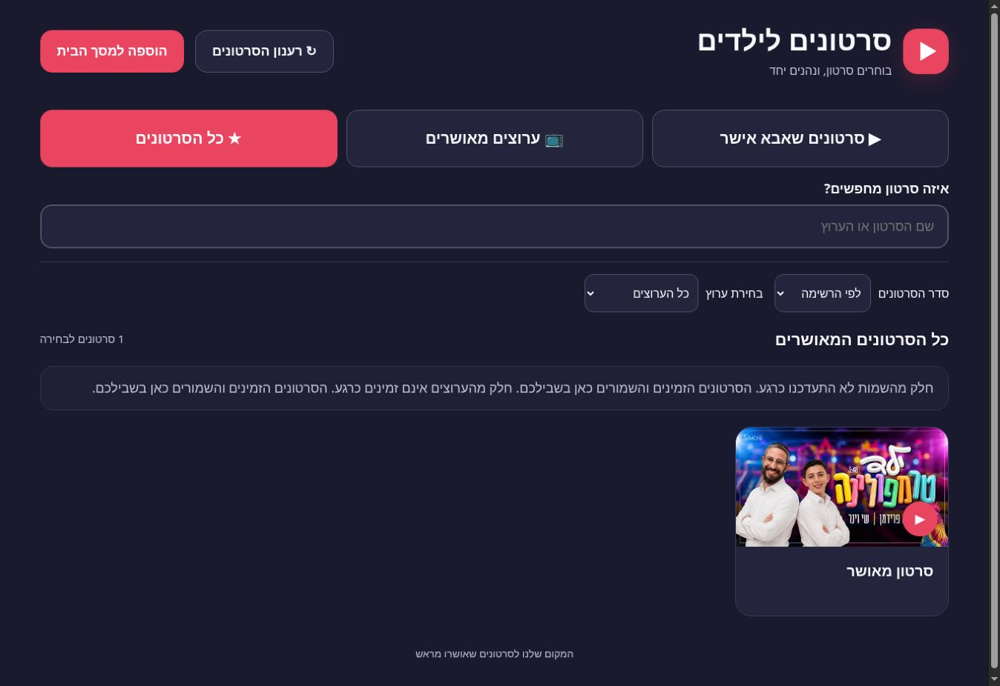

# בדיקת השדרוג — 6 באוקטובר 2026

## סטטוס אמיתי

השדרוג נבנה ופורסם, אך **אין אישור שכל מסלולי הניגון הציבוריים זמינים**. ניגון חי ב־Invidious הצליח בתחילת הבדיקה, ובהמשך הספק הציג Anubis/״Making sure you're not a bot״ לדפדפן הבדיקה. לא נעקפה החסימה ולא בוצעה בדיקה חוזרת שלה. GitHub Pages בלבד, בלי שרת, לא מאפשר לתקן CORS של ספק או להבטיח זמינות שלו. אין fallback אוטומטי ל־YouTube שעלול להוסיף פרסומות.

## קוד ו־CI

117 בדיקות Node עברו באמצעות `node --test tests/*.test.cjs`, ללא התקנת packages. הקוד האמיתי של app.js/providers.js/player.js/service worker נבדק; ה־DOM, המדיה וה־API מדומים בבדיקות היחידה. בדיקות אלו אינן הוכחה לניגון אצל ספק חיצוני. GitHub Actions מריץ את הבדיקות לפני פריסה סטטית; אין build step.

הבדיקות מכסות שלושה טאבים והפרדת הרשאות, קישורים/הערות/כינויים ושמות אוטומטיים, ביטול אישורים ומטמון, channel ID שאינו מתאים, pagination לפי דרישה, maxVideos, כפילויות, token שחוזר וגבול 100 עמודים, חיפוש מקומי, מיון/סינון, מטמון TTL וכשל quota, 401/403/404/429/500, TypeError של רשת/CORS, timeout גם בגוף התשובה, cooldown, coalescing, health check, ביטול בקשות ולחיצות מהירות, אירועי מדיה מאוחרים, autoplay חסום, סגירה, מסלול תאימות, אימות מקור/שולח בהודעות הנגן וניתוק listener בסגירה, CSP עם נתיב הסרטון המדויק, deadline לנגן, PWA, shell offline ונתיבים יחסיים.

## דפדפן אמיתי

- Desktop Chrome: שלושת הטאבים נפתחו. ברשימה החדשה שההורה עדכן במהלך העבודה, ״ילד טרמפולינה״ הופיע בטאב הידני; ערוץ מאיר הופיע בטאב הערוצים; האיחוד הציג 61 סרטונים, בלי שיוך יוצר הסרטון הידני לערוצים המאושרים.
- ערוץ מאיר זוהה בשמו ותמונתו, ונטענו 60 סרטונים בעמוד הראשון. במכשיר בעל מטמון קודם הוצגו גם 368 סרטונים שמורים, תוך שמירה על האישורים. אין הצגה של מספר זה כ״סך כל הסרטונים בערוץ״.
- Mobile layout: האתר האמיתי הוצג ב־iframe בדיקה ברוחב 390px. שלושת הכפתורים היו זמינים, וה־DOM נמדד ללא גלילה אופקית. זו בדיקת פריסה בדפדפן שולחני, **לא** התקנה או בדיקה על Android פיזי.
- אחרי הפריסה הסופית אומתו גם רוחב בדיקה 820px לטאבלט וטעינת קובצי JS בגרסה `20261006d`. רוחב תוכן/גלילה היה 375/375 במובייל ו־805/805 בטאבלט, אחרי מקום לפס הגלילה. שלושת הטאבים הראו 1 סרטון ידני, 1 ערוץ ו־61 סרטונים באיחוד. `player.html` העצמאי נטען והציג את ההנחיה לבחור סרטון באפליקציה, ללא הפעלת הספק שנחסם. הבדיקות והפריסה ב־GitHub Actions הצליחו.
- ניגון הסרטון `1n0KaepuxJY`: הנגן הישן של f5 ניגן בפועל, עם זמן מתקדם ומשך 17:56. במקור MP4 הישיר של הגרסה החדשה התקבל error מכל שלושת הספקים. הקוד עבר בפועל למסלול התאימות, שבו הופיעה חסימת Anubis של הספק. לא נטען כי iframe load מוכיח ניגון.
- חסימות API: בבדיקת לקוח HTTP נפרד התקבלו 401/403 וחוסר CORS; f5 הציג חסימת Cloudflare לאותו לקוח. לא נעשו ניסיונות לעקוף אותה. בבדיקת הדפדפן עצמו, API של f5 כן הצליח. הצלחה/כישלון תלויים בלקוח ובזמן.

## בקשות וביצועים

בטעינה חיה אחת של ערוץ בלבד התקבלו שלוש בקשות API תקינות: זיהוי הכינוי 911ms, פרטי ערוץ 1054ms ועמוד סרטונים 958ms. אין בקשת metadata לכל כרטיס ערוץ. הסרטון הידני החדש מוסיף בקשת שם אחת. בפתיחה חוזרת נצפו cache hits, וה־whitelist עדיין נמשך מחדש.

60 כרטיסים רונדרו, אך הדפדפן טען בתחילה כ־20 thumbnails הקרובים למסך, ולא את כל 60 התמונות. נצפו thumbnail nodes שנוצרו מחדש בעת עדכון metadata; זה תוקן כך שה־node והתמונה נשמרים והשמות מתעדכנים כטקסט. בדיקות נוספות מגינות על ההתנהגות הזאת. מקור מדיה שלא זמין עבר fallback בפועל, ולא רק הסתעפות בקוד.

התיעוד נעשה באמצעות Console logs, נתוני Resource Timing ותיעוד requests מתוך מצב `?diagnostics=1`. אין טענה שנלכד HAR מלא או שכל בקשות המדיה הפנימיות של iframe נצפו. Resource Timing אינו חושף תמיד גדלי העברה של מקורות חיצוניים. מצב הבריאות מציג גם inflight; בקשות API מוגבלות בזמן וניסיונות אינם אינסופיים.

## תיקונים נוספים שנמצאו בבדיקה

- בקובצי app shell הוגדר network-first עם no-store, ונוספה גרסה לכתובות קובצי JS. דפדפן ששמר קובץ JS ישן לאחר פריסה גרם לבדיקות להריץ קוד קודם; נבדק בהמשך שה־DOM מצביע על קובצי הגרסה החדשה.
- נגן iframe נבנה עם URL ו־deadline **לפני** הכנסתו ל־DOM. אירוע about:blank מוקדם לא יכול לצרוך את listener או להשאיר timer שמפסיק נגן שכבר נטען. הוספה כזאת גרמה בבדיקה למעבר שגוי למקור הבא; נוספה בדיקה לתיקון.
- סינון גלובלי לפי ערוץ אינו מסתיר אישורים ידניים ואינו חוסם טעינת עמודים בתוך ערוץ אחר.
- תקציב התאימות שפג מסתיים במסך שגיאה, ולא בהמתנה תקועה.
- כשל במקור MP4 אינו פוסל אוטומטית את אפשרות התאימות באותו ספק; capability של native, API ו־playback נפרדות.
- מידע שמור של ערוץ אינו הוכחת שיוך של סרטון. לפני הפעלת סרטון ערוץ שלא אושר ידנית ולא התקבל מרשת בזמן הריצה, נדרש אימות authorId עדכני.
- שמות, הערות, חיפוש ו־metadata מוכנסים כטקסט. IDs מוגבלים, תמונות מוגבלות למקורות ידועים, והנגן מקבל URL שנבנה מרשימת הספקים הקבועה בלבד.

## Sandbox ומגבלות אבטחה

האפליקציה הראשית מאפשרת iframe ממקור מקומי בלבד. `player.html`/`player.js` המקומיים מקבלים הודעת אתחול רק מההורה האמיתי ומאותו origin; סרטון קבוע אחד לכל מסמך. לפני יצירת iframe חיצוני נקבע CSP frame-src לכתובת embed המדויקת של הסרטון שנבחר. כתובת עם credentials, ID לא תקין או ספק בעל origin זהה לאפליקציה נדחים. Sandbox חיצוני מאפשר scripts/same-origin/presentation לצורכי מקור/אחסון/העדפות של הנגן, בלי popups, forms או top navigation. אין allowfullscreen כפול; הרשאות באמצעות allow בלבד. השילוב נבדק מול ההסבר ב־MDN, ולא הוסף באופן אוטומטי לכל כתובת. מדיניות המסך המקומי והודעותיו נבדקו ביחידות; ניגון חי דרכו לא נבדק מחדש אחרי חסימת הספק.

ה־sandbox לבדו אינו whitelist של נתיבים. המסך המקומי מוסיף הגבלה לנתיב embed המדויק ומונע ניווט רגיל ל־watch/search/embed אחר. אין טענה לסינון מלא: CSP מתעלם מהתאמת נתיב אחרי HTTP redirect, והספק עדיין שולט בתוכן שמוגש בכתובת המותרת. localStorage אינו מחסום נגד מי שיש לו גישה ל־DevTools/למכשיר. מכשיר offline אינו יכול לדעת מיד על אישור שבוטל מרחוק. התקנה ונעיצת מסך על Android פיזי עדיין לא נבדקו.

## Console

לא נצפו exceptions של האפליקציה או unhandled rejections בתיעוד Console הזמין. נצפו הודעות של הרחבת סביבת הבדיקה, שאינן קוד האתר. בנגן Invidious הישן נצפו אזהרות Video.js של הספק. אירועי HTTP/CORS/מדיה כושלים טופלו ב־fallback/הודעה; אין טענה לאפס שגיאות רשת חיצוניות או לאפס אזהרות בתוך iframe. הודעת הדפדפן על lazy images/deferred load היא מידע תקין, ולא סיבה לבטל lazy loading.

## שלא אומת

התקנה על Android אמיתי; ניגון מוצלח של כל ספק וכל transport בגרסה הסופית; התאוששות מכל שגיאה פנימית ב־iframe בלי התערבות; סטרימינג offline; זמינות מתמדת של ציבור Invidious. אין בממצאים בסיס לטענה שהמערכת כבר אמינה ב־100% או שכל הדרישות הללו הושלמו.

מקורות ראשוניים: https://docs.invidious.io/api/ , https://docs.invidious.io/url-parameters/ , https://docs.invidious.io/instances/ , https://developer.mozilla.org/en-US/docs/Web/HTML/Reference/Elements/iframe , https://www.w3.org/TR/CSP/#match-url-to-source-expression .

## צילום ממשק וחיפוש

## המשך ממוקד — ללא audit חדש

הוסרה דרישת metadata כפולה לפני embed. סרטון שאושר ידנית יכול להגיע לנגן התאימות גם כשה־API מחזיר 401/403/500 או כשל רשת/CORS. סרטון מרשימת ערוץ שמורה עדיין חייב לקבל אימות שיוך מהרשת; אין שימוש במטמון כהוכחת אישור. האישורים נבדקים מחדש בכל מעבר למקור אחר.

ניסיון iframe שפג בזמן מתועד ומפעיל cooldown; כשל frame נשמר זמנית עבור אותו סרטון. כפתור הניסיון החוזר מנקה את סימוני native/embed ואת סימון בקשת האימות, ומסיר העדפת תאימות ישנה עבור אותו ID. חסימת גישה ל־localStorage ברמת getter אינה מפילה startup. המסך המקומי מדווח להורה על הפרת frame-src שנאכפת, ללא טקסט טכני לילד.

נוספו בדיקות ממוקדות לכל אלה; תחביר app/providers/player/sw תקין. גרסת app shell הועלתה ל־v8 וקובצי JS ל־20261006e. בדיקות היחידה מדמות את הנגן וה־API; לא בוצע ניסיון חוזר אצל הספק שכבר הציג חסימת bot, ואין כאן הוכחת זמינות או ניגון חי חדש.

לאחר הפריסה אומתה טעינת 20261006e באתר החי. באותו startup לא התקבלו שמות/סרטוני ערוצים מהספקים, אך הסרטון הידני והתמונה שלו נשארו גלויים, עם הודעה ידידותית; לא התקבל מסך ריק. בתיעוד Console הזמין הופיעה שגיאה של הרחבת סביבת הבדיקה בלבד, ללא exception מזוהה של קוד האפליקציה. הפריסה של commit הקוד הסתיימה בהצלחה.

## בדיקה חיה ממוקדת — 2026-10-06, המשך גרסאות f–h

לא בוצעה התחלה מחדש. מצב הקוד הקודם והבדיקות נקראו לפני השינוי, ורשימת הקישורים של ההורה נשמרה ללא שינוי.

### תקלות שתוקנו

- ״נסו נגן אחר״ ביטל העדפת תאימות שמורה וסימן את המקור הקודם כלא מתאים למשך 30 שניות לסרטון המסוים. פתיחה חדשה אינה חוזרת מיד לאותו מקור; סרטונים אחרים אינם נפסלים בגללו.
- במסך האבחון בלבד (`?diagnostics=1`) נוספה השהיה מקומית של מקור קיים למשך חמש דקות. השהיה נשמרת גם ללא היסטוריית health, אינה מתבטלת בגלל תשובה מאוחרת/ניסיון חוזר/בדיקת בריאות, ופגה אוטומטית. לא נוספו מקורות או proxy. כך ניתן היה להחריג את f5, שכבר הציג חסימת bot, בלי לנסות לעקוף אותה.
- בפועל התברר שה־iframe האחרון יכול לטעון דף סירוב להטמעה, ובאותו מצב כפתור המעבר היה מוסתר. נוסף כפתור ״הסרטון לא מתחיל״ גם אחרי המקור האחרון, שמסיים את הסבב במסך שגיאה ידידותי ומנתק את המדיה. הוא נבדק בדפדפן בגרסה g.
- הוסרה הודעת שגיאה כפולה במסך הכישלון, והודעת השגיאה המרכזית הוגדרה כ־alert לנגישות. גרסה סופית: JS `20261006h`, shell `v11`.

### ניגון בפועל: התוצאה אינה הצלחה

הסרטון הידני `mVTlbvQ_010` נשאר גלוי עם thumbnail ונפתח גם כששמות/מידע ערוצים אינם זמינים. נבדק המסלול החי מתוך האפליקציה ב־GitHub Pages, ולא רק iframe שהוכן במבחן יחידה:

1. f5 הושהה במכשיר הבדיקה בגלל החסימה שכבר אומתה קודם. לא בוצע ניסיון ניגון נוסף בספק זה ולא שונו fingerprint/רשת כדי לעקוף אותו.
2. tiekoetter: מקור MP4 נכשל לאחר כ־2470ms; המעבר האוטומטי ל־embed התרחש. ה־embed הציג דף ספק עם “Please refresh the page”, שם שרת Companion, חיפוש וקישורי Invidious. לא הופיע נגן עובד. זו שגיאת ספק רגילה; אין בממצא זה הוכחת bot detection חדשה.
3. לחיצה על ״נסו נגן אחר״ עברה בפועל ל־chocolatemoo. מקור MP4 נכשל לאחר כ־400ms והאפליקציה עברה אוטומטית ל־embed. ה־iframe הציג “refused to connect”. זה אינו הוכחת bot detection. בדיקה נוספת אחת של המקור האחרון בגרסה g אימתה את הכפתור המתוקן ואת הסיום הידידותי, ללא סבב אינסופי.
4. לחיצה על חזרה הסירה את כל המדיה. לחיצה על הכפתור האחרון הסירה את המדיה והציגה הודעה ידידותית. כשהמקורות מושהים, הסרטון הידני עדיין מופיע ופתיחתו מסתיימת מיד בהודעה ידידותית, בלי בקשות מדיה.

**לא אומת ניגון חי מוצלח בגרסה הנוכחית.** fallback אוטומטי מ־MP4 ל־embed ומעבר בין ספקים בלחיצה אומתו; שגיאה פנימית בדף iframe חיצוני אינה מזוהה אוטומטית ככשל רק משום שאירוע load התקבל. נותרת אפשרות שדף שגיאה של הספק יציג לילד טקסט טכני או חיפוש פנימי, עד שילחץ על כפתור החלופה/הכישלון. sandbox/CSP מגבילים ניווט, אך אינם משנים את תוכן הדף החיצוני. אין כאן הבטחה לניגון אמין או הסתרה מלאה של שגיאות ספק.

GitHub Pages בלבד אינו מספק שרת stream או proxy משלנו. CORS של ספק חיצוני או סירובו להטמעה אינם ניתנים לתיקון בקוד הדפדפן שלנו. לא נמצא בבדיקה מקור קיים שמספק כרגע ניגון מצליח; לא הוספו URLs כדי להציג מצג של אמינות, ולא הוחלף הנגן ב־YouTube עם פרסומות. זו מגבלה פתוחה, ולא דרישה שהושלמה.

### ממשק וביצועים בפועל

- Desktop: הטאבים הציגו 1 סרטון ידני, 1 ערוץ מאושר, ו־1 סרטון באיחוד; אין כרטיס כפול. ערוץ מאיר נפתח בנפרד עם 0 סרטונים זמינים והודעה מתאימה. סרטוני הערוץ לא נטענו מהרשת בבדיקה זו, ולכן אין טענה לניגון חי מתוך ערוץ או למעבר חי בין שני סרטונים שונים. בדיקות אוטומטיות מכסות את אישורי הערוץ, האיחוד ו־race בין שני IDs.
- חיפוש בתוכן המאושר סינן את הרשימה. חיפוש ללא תוצאה הציג ״לא מצאנו. נסו שם אחר״; כפתור ניקוי החזיר את הרשימה. לא נשלחה בקשת חיפוש ל־YouTube.
- האתר האמיתי נבדק ברוחבי iframe של 390 ו־820: clientWidth/scrollWidth היו 375/375 ו־805/805 בהתאמה, RTL ושלושת הטאבים עבדו. זו בדיקת פריסה ב־Chrome שולחני, לא מכשיר Android אמיתי.
- startup שנמדד: whitelist כ־98ms; שני ניסיונות metadata ידני, כ־460ms וכ־757ms, הסתיימו ב־NETWORK_OR_CORS; זיהוי ערוץ ושמו הגיעו ממטמון. thumbnail אחד נטען, ולא נדרש metadata חדש בפתיחת הסרטון. אין API fan-out לכל כרטיס.
- בכל מקור שנבדק התבצע ניסיון native אחד ומסך bridge מקומי אחד. שני requests לאותו player.html היו לשני ניסיונות נפרדים, ולא בקשה כפולה בלתי נחוצה. inflight ב־API היה 0 לאחר הסיום.
- Console הזמין בשני המסכים הציג הודעות שגיאה של הרחבת סביבת הבדיקה בלבד; לא אותר exception של האפליקציה או unhandled rejection. אין טענה לתיעוד מלא של כל Console פנימי/Network ב־iframe החיצוני. נבדקו Resource Timing ותיעוד requests מתוך האפליקציה; HAR מלא אינו זמין בכלי בדיקה זה.

ראיות הבקשות: [live-provider-audit-20261006.json](qa/live-provider-audit-20261006.json). בדיקות Node: **122/122 עברו**; תחביר app/providers/player/sw תקין. בדיקות היחידה עדיין משתמשות ב־API ובמדיה מדומים ואינן הוכחת זמינות של ספק ציבורי. פריסת גרסה g הסתיימה בהצלחה ב־GitHub Actions.
